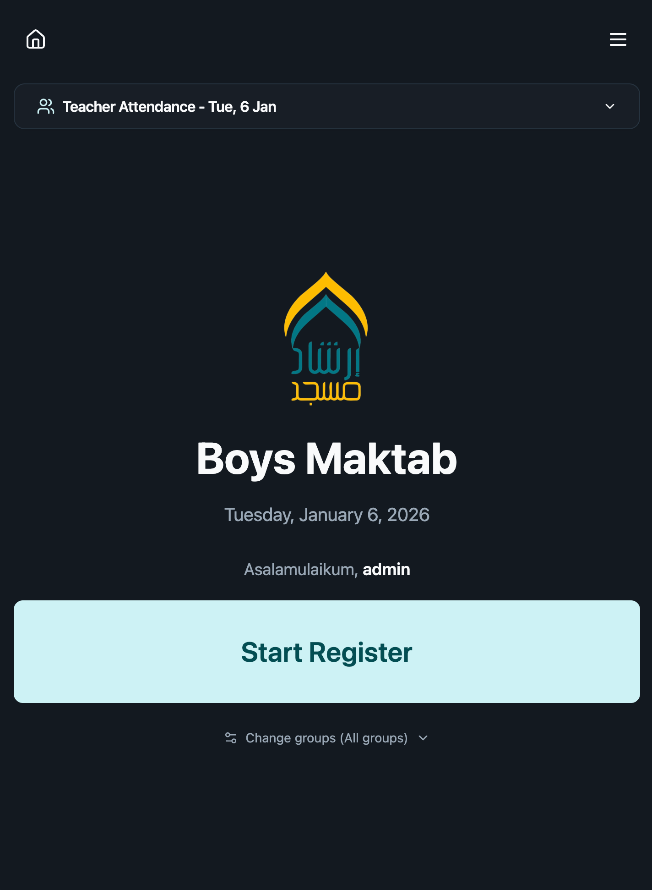
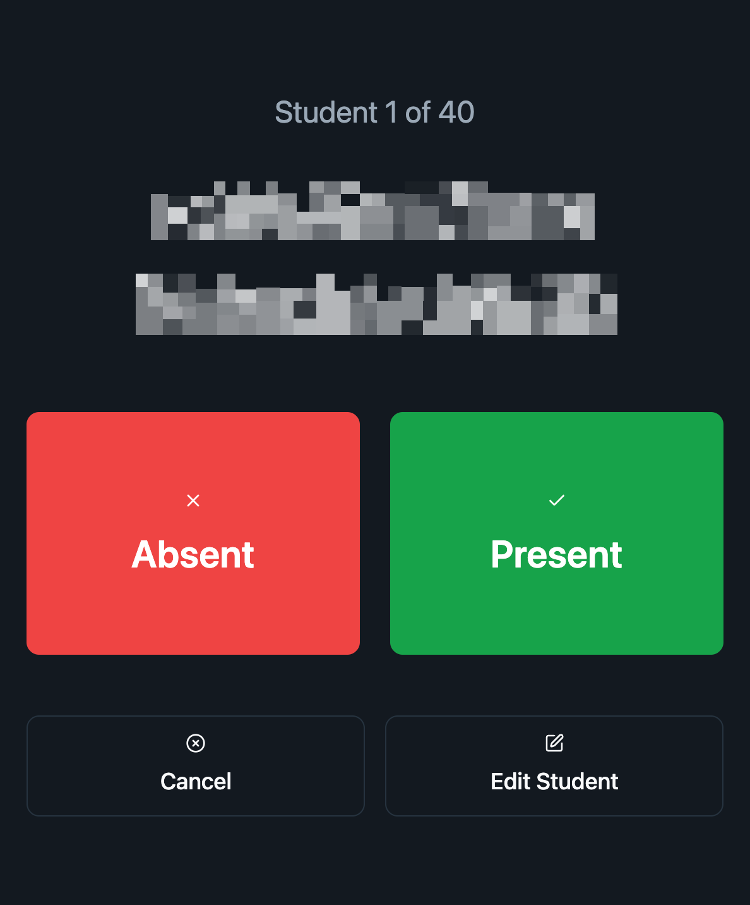
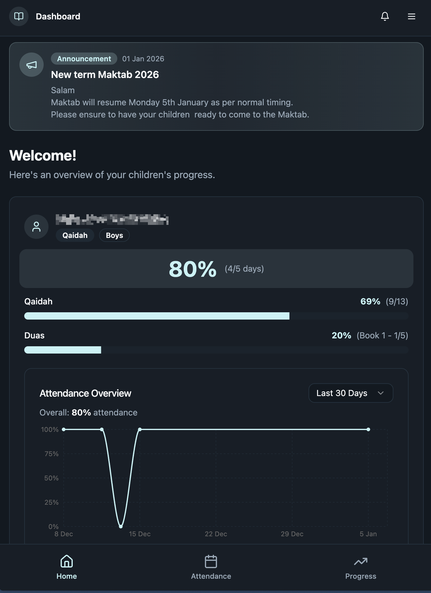
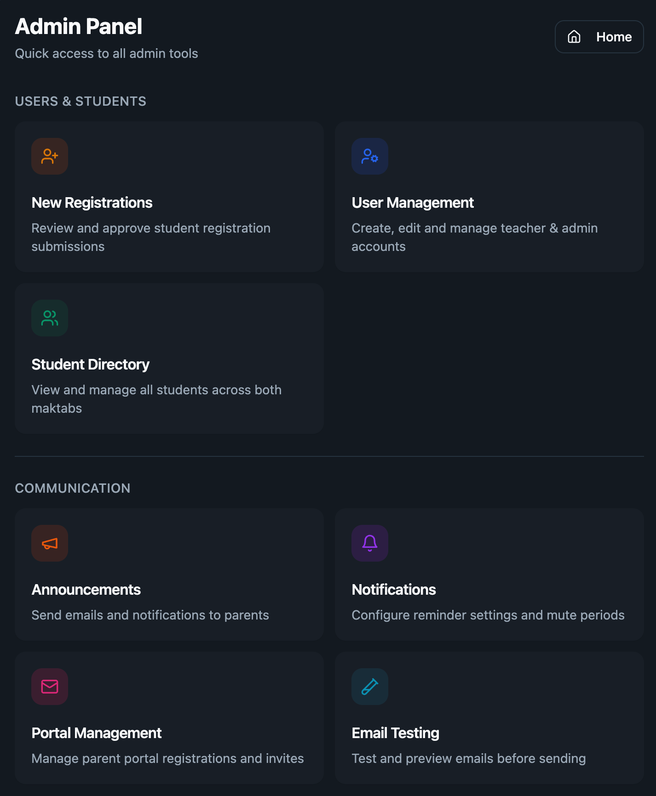

# Maktab Student Management System

## 📚 Overview

A student management system for Masjid Irshad Luton maktabs and madrasahs that centralizes student records, attendance, academic progress, and payments. The platform supports multiple curriculum tracks (Qaidah, Quran, Hifz), role-based access for admins, teachers, and parents, and provides parents with clear visibility into progress and attendance—reducing administrative overhead and replacing paper-based workflows.

---

## 🎓 Core Student Management

### Student Directory
- Centralized student list
- Filter by maktab (Boys / Girls), status, and group

### Student Groups
- **Group A (Qaidah)**  
  Levels 1–13 + Duas Book 1 & 2
- **Group B (Quran)**  
  Juz 1–30, Tajweed Levels 1–7, Duas
- **Group C (Hifz)**  
  Juz Amma surahs, Sabak, Sabak Para, Daur tracking

### Graduation System
- Promote students between groups
- Progress reset handled automatically

---

## ✅ Attendance Tracking

- Mobile-friendly teacher interface
- Automatic teacher attendance when recording students
- Per-group attendance history with filters
- Monthly reports highlighting low and perfect attendance

  
  

---

## 📈 Progress Tracking

- Monthly progress prompts for teachers
- Historical progress snapshots
- Parent notifications on updates
- Milestone completion tracking:
  - Qaidah
  - Tajweed
  - Quran
  - Hifz

---

## 💳 Payments (Stripe)

- Separate Stripe accounts for Boys/Girls maktabs
- Payment links with admission fee + subscription
- Automatic 10% sibling discount
- Webhook-based activation on payment completion
- Customer billing portal access
- Stripe integration eliminated missed and delayed payments, increasing collected revenue  
  (observed increases of ~**133%** in monthly teacher income in real deployments)

---

## 👨‍👩‍👧 Parent Portal

- Passwordless magic-link authentication
- Dashboard with progress and attendance charts
- Time-range views (7 days to 12 months)
- Notifications feed
- Profile management

---

## 🛠️ Admin Panel

- User management (teachers, roles)
- Registration review and approval
- Announcements (email + portal, image support)
- Audit logs for student, attendance, and progress changes
- Teacher attendance tracking with notes
- Email template preview/testing
- Ghost mode (view as teacher or parent)
- Parent invite and portal access management
- Public website event management

---

## 🔐 Security & Access Control

- Role-based access: Admin, Teacher, Parent
- Row-Level Security (RLS) on all tables
- Authenticated edge functions
- Comprehensive audit logging
